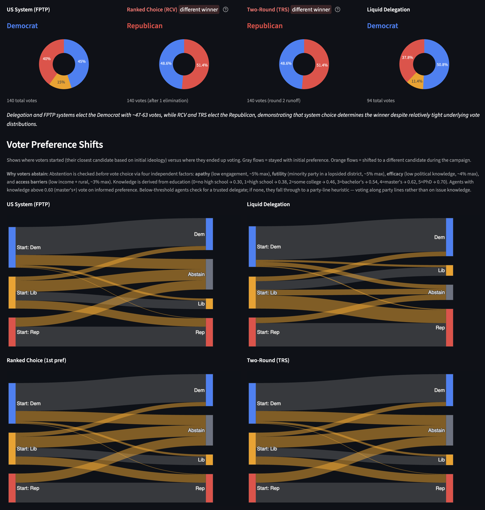
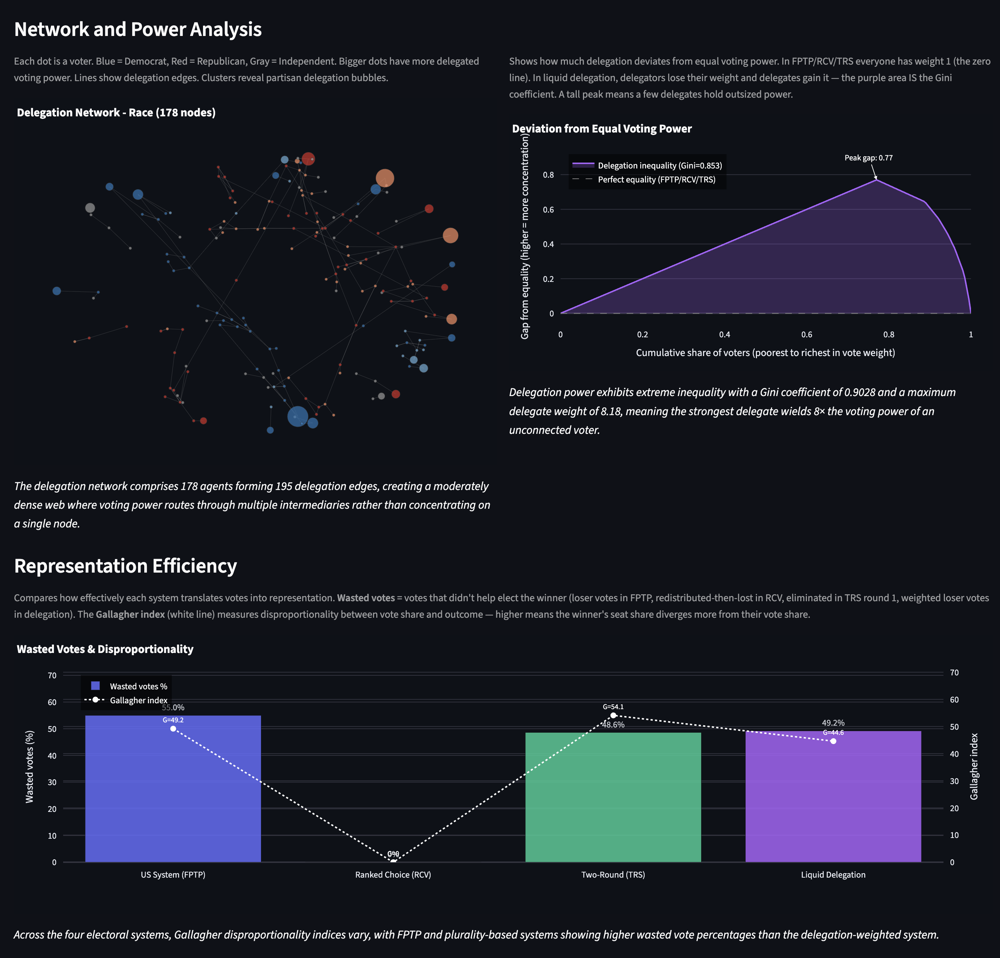
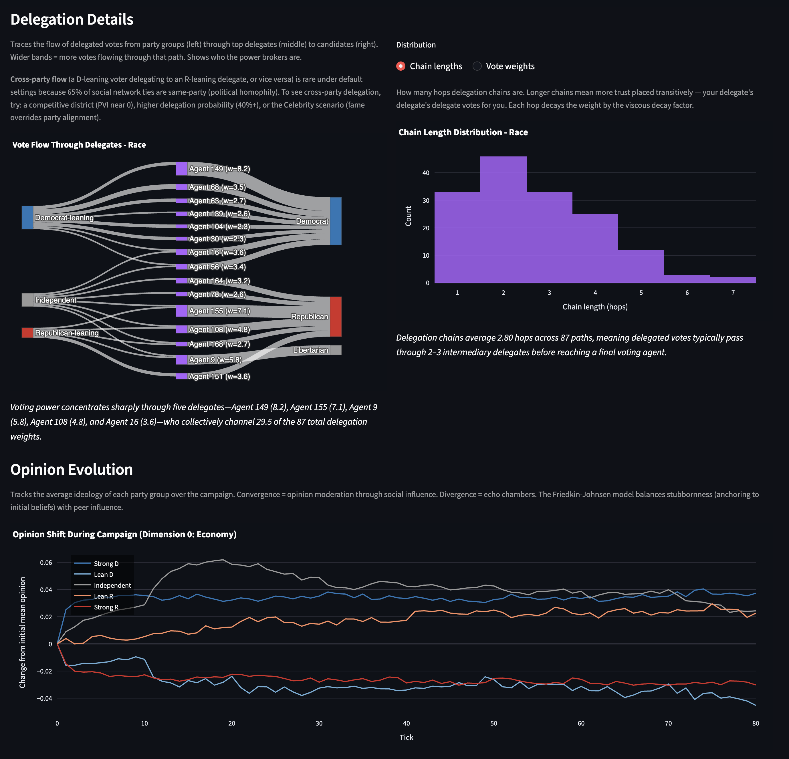
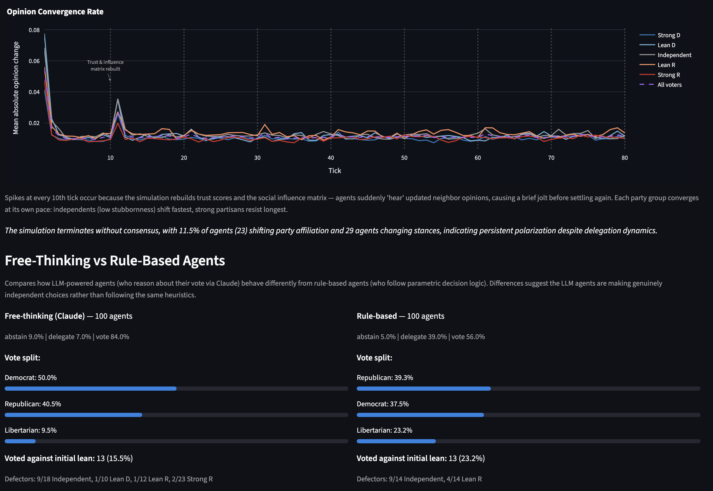
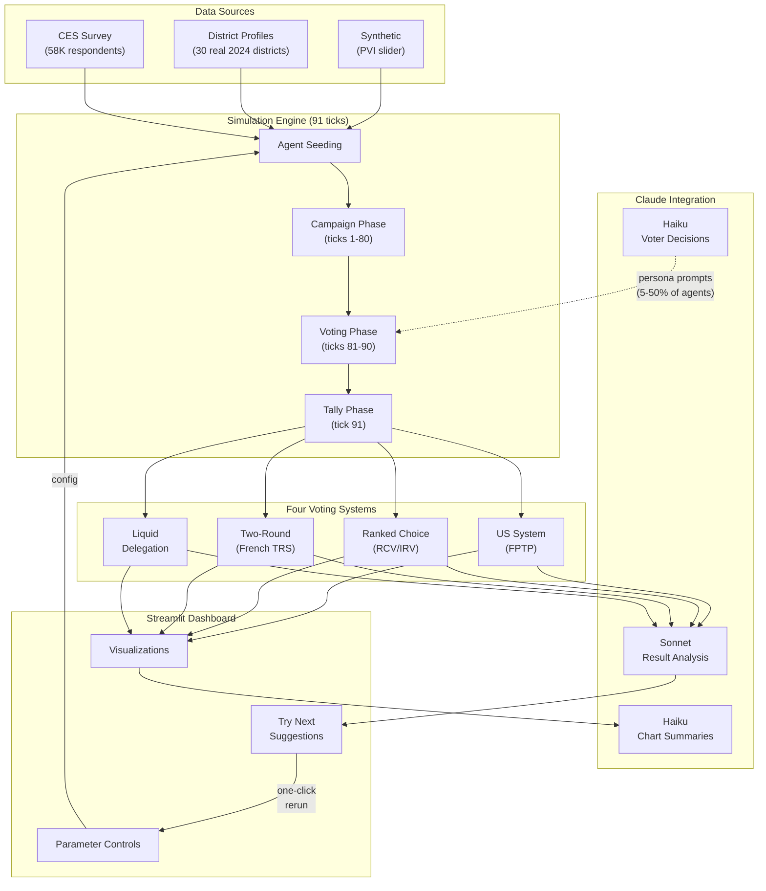
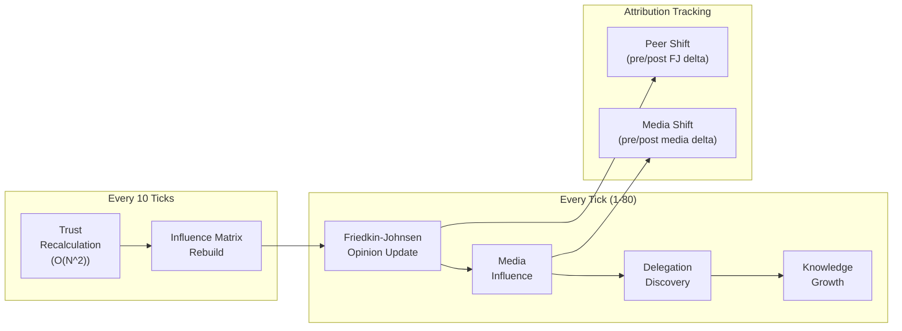
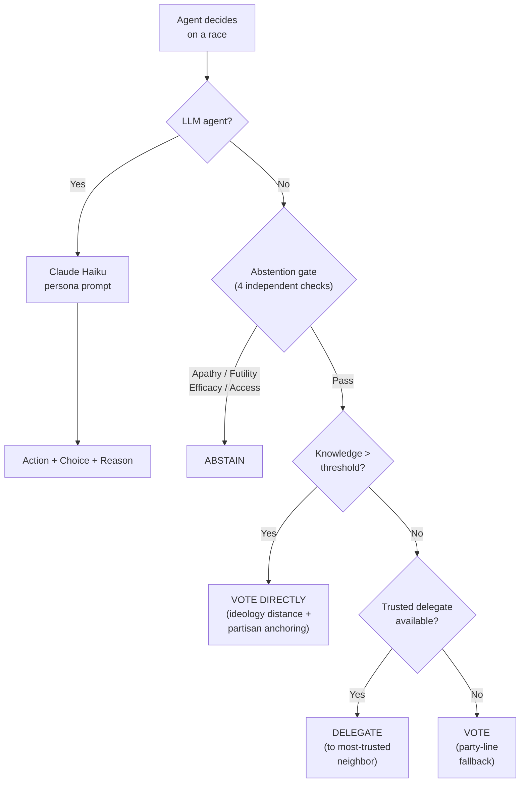
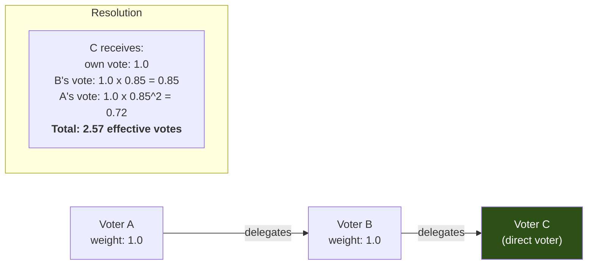

# Liquid Democracy Simulation Engine

An agent-based simulation that models liquid democracy, where voters can either vote directly or delegate their vote to someone they trust, and compares outcomes across four electoral systems on the same electorate. Seeded from real U.S. congressional district data and the 2024 Cooperative Election Study (58,738 actual survey respondents), it uses Claude as both a voter reasoning engine and an interpretive analysis layer for the user.

For setup, please refer to the [Quick Start Guide](#quick-start) below or run `make setup; make dashbaord`.
<br>

<p align="center">
  
</p>
<p align="center">
  
</p>
<p align="center">
  
</p>
<p align="center">
  
</p>

## Motivation

Every few years, liquid democracy resurfaces as a proposed fix for democratic representation: let informed citizens accumulate delegated votes from those who trust them, producing better-informed outcomes than uninformed direct voting. The theory is compelling. The practice has been troubling.

Real-world deployments - Germany's Pirate Party (LiquidFeedback), Google's internal experiment (Google Votes), and several municipal pilots - all produced the same pattern: **severe power concentration**. Gini coefficients of 0.64-0.99 emerged naturally, meaning a handful of "super-delegates" accumulated enormous voting power while most participants' influence approached zero. The cure for uninformed voting created a new disease: plutocratic delegation.

This project was built to answer a set of interconnected questions:

- **Does liquid democracy actually change election outcomes**, or do the same candidates win regardless of the voting system?
- **How concentrated does power become** under realistic conditions, and what mechanisms (weight caps, vote splitting, viscous decay) actually mitigate it?
- **How do opinion dynamics and trust networks interact with delegation** - does social influence drive people toward or away from delegating?
- **Can AI-driven voters make qualitatively different decisions** than rule-based agents, and what does that tell us about the role of reasoning in democratic participation?

Rather than modeling these questions in isolation, the simulation runs all four electoral systems - FPTP, RCV, TRS, and liquid delegation - on the **same population with the same opinions**, so differences in outcomes are attributable purely to system mechanics. The interactive dashboard lets you tune 30+ parameters and immediately see how they shift results, with Claude providing real-time interpretation of what the numbers mean for electoral system design.

## The Four Electoral Systems

| System | How It Works | What It Reveals |
|--------|-------------|-----------------|
| **US System (FPTP)** | One vote, highest count wins. All loser votes are "wasted." | Baseline: the system Americans actually use. |
| **Ranked Choice (RCV)** | Voters rank candidates. Lowest eliminated and redistributed until majority. | Whether wasted-vote recovery changes the winner. |
| **Two-Round (TRS)** | French-style. Round 1 with 12.5% threshold, strategic withdrawal, round 2 plurality. | Whether a runoff produces different consensus than instant methods. |
| **Liquid Delegation** | Vote directly OR delegate to someone you trust. Delegations chain transitively and decay per hop. | The core question: does informed delegation improve or distort representation? |

## How the Simulation Works

The simulation runs 91 ticks across three phases:

### Phase 1: Campaign (ticks 1-80)

Agents form opinions, build trust, and discover potential delegates:

- **Friedkin-Johnsen opinion dynamics**: agents update beliefs based on weighted neighbor influence, anchored to initial positions by stubbornness (strong partisans resist change; independents are highly persuadable)
- **Trust evolution**: trust between agents evolves based on ideological agreement (cosine similarity of 10-D ideology vectors), social proof (popular delegates attract more trust), and betrayal penalties
- **Delegation discovery**: agents probabilistically discover trusted neighbors who could serve as delegates, with preferential attachment (popular delegates attract even more delegators)
- **Media influence** (optional): 10 modeled U.S. media outlets shift agent opinions based on reach, credibility, and ideological targeting
- **Knowledge growth**: agents learn about races over time, crossing the threshold from "need a delegate" to "can vote directly"

### Phase 2: Voting (ticks 81-90)

Agents commit their decisions:

1. **Abstention gate** - four independent checks: apathy (low engagement), futility (strong minority in lopsided district), efficacy (low knowledge), and access barriers (low income + rural)
2. **Knowledge check** - informed agents vote directly using ideology-distance to candidates, with partisan anchoring (strong partisans get a distance bonus toward their party's candidate)
3. **Delegation check** - uninformed agents with a trusted neighbor delegate their vote
4. **Party-line fallback** - remaining agents vote by party heuristic

For LLM-enabled agents (~5-50%), Claude receives a persona prompt with the agent's full demographic and ideological profile and returns a reasoned JSON decision with explanation.

### Phase 3: Tally (tick 91)

All four voting systems run on the same ballot data. Delegation chains resolve with viscous decay (0.85 weight retained per hop), cycles are detected (votes lost), and the Gini coefficient measures power concentration.

## Experiments You Can Run

### Scenarios

| Scenario | What It Tests |
|----------|---------------|
| **Baseline** | Organic delegation with default parameters. Natural equilibrium without shocks. |
| **Celebrity** | A famous figure enters mid-campaign (tick 40), attracting delegations through fame, not expertise. Tests charismatic capture. |
| **Hub Attack** | An adversary compromises top delegation hubs, shifts their ideology + boosts their trust. Tests network resilience. |
| **Stale Decay** | Delegations persist without review. Delegates drift ideologically while retaining power. Tests accountability decay. |
| **k=2 Mitigation** | Each voter delegates to 2 people (vote split 50/50). Tests whether max weight drops from O(sqrt(n)) to O(log(n)). |

### Key Parameters to Explore

| Parameter | Default | Try This | Why |
|-----------|---------|----------|-----|
| Delegation probability | 10% | 40-60% | See power concentration spike as more people delegate |
| Viscous decay (alpha) | 0.85 | 0.5 vs 1.0 | Low decay kills long chains; no decay enables unlimited power accumulation |
| Weight cap | None | 10 or 25 | Hard ceiling on max delegate power - the simplest concentration fix |
| Delegation options (k) | 1 | 2 or 3 | Vote splitting across multiple delegates dramatically reduces Gini |
| Bounded confidence | Off | 0.2 | Creates echo chambers - agents only listen to ideologically similar peers |
| Homophily | 0.65 | 0.3 vs 0.9 | Controls cross-party network ties; low homophily enables cross-party delegation |
| PVI lean | 0 | D+20 or R+20 | Safe districts show futility abstention; competitive districts show system divergence |
| LLM agent fraction | 5% | 20-50% | Compare Claude's reasoning to rule-based decisions on swing voters |

### Data Sources

| Mode | Source | What It Provides |
|------|--------|-----------------|
| **Synthetic** | PVI slider | Parametric distributions from Cook PVI lean. Fast, no external data. |
| **2024 District Profiles** | 30 embedded districts | Real congressional districts with Cook PVI, Census demographics, racial composition, and 2024 results. From CA-27 (D+1 toss-up) to TX-13 (R+28 safe). |
| **2024 CES Survey** | Harvard Dataverse | 58,738 actual survey respondents from the Cooperative Election Study. ~100-230 per district. Auto-downloads 184 MB CSV on first use. |

## How Claude Powers the Simulation

Claude serves three distinct roles in this system, each using a different model optimized for the task:

### 1. Voter Reasoning Engine (Claude Haiku)

A configurable fraction of agents (0-50%) use Claude to make voting decisions instead of rule-based logic. Each LLM agent receives a persona prompt containing their demographics, 10-dimensional ideology vector, trust network opinions, and race context. Claude returns a structured JSON decision:

```json
{
  "action": "vote",
  "choice": "Democrat",
  "reason": "As a moderate independent with slight left lean on healthcare and environment, the Democratic candidate aligns better despite my fiscal conservatism."
}
```

LLM agents are **preferentially selected from centrist and swing voters** - where reasoning produces qualitatively different decisions than simple ideology-distance heuristics. Strong partisans vote predictably regardless, so Claude's reasoning budget is spent where it matters.

Agents are batched (20 per call) with an ultra-compact format (~54 characters per agent) to stay within token limits. An adaptive rate limiter starts at 600 RPM and auto-throttles on 429 status code errors, recovering gradually on success. Partial errors are handeld by those set of voters abstaining, with an error indicator shown on the top of the simulation results.

### 2. Simulation Analyst (Claude Sonnet)

After each simulation run, Claude Sonnet receives the complete results - every vote count, RCV elimination round, TRS runoff, delegation chain metric, and Gini coefficient - along with the full parameter configuration. It generates a structured analysis covering:

- **System Agreement**: Which systems agreed or disagreed on winners, with specific vote counts
- **Power Concentration**: Gini coefficient interpretation against real-world benchmarks
- **Delegation Impact**: Whether delegation changed the outcome vs. FPTP
- **Electoral Reform Takeaway**: Key insight for electoral system design
- **Try Next**: 2-3 specific parameter changes with machine-readable JSON tags that become one-click buttons in the dashboard

The "Try Next" recommendations create a guided exploration loop: run a simulation, read Claude's analysis, click a suggestion button, and immediately see how different parameters change outcomes.

### 3. Chart Interpreter (Claude Haiku)

Every visualization in the dashboard gets a one-sentence AI-generated summary highlighting the most notable pattern in that specific data. These summaries are generated in a single batched call, providing instant interpretive context without requiring the user to parse complex charts.

For example, under an opinion evolution chart: *"Independent voters shifted 0.15 points rightward by tick 40, converging with Lean R voters as bounded confidence of 0.4 created a center-right echo chamber."*

This three-layer approach means Claude acts as both a **participant** in the democratic process (voter reasoning) and an **interpreter** of its outcomes (analysis + chart summaries), giving the user a uniquely rich understanding of what happened and why.

## Dashboard

The Streamlit dashboard is the primary interface for running simulations and interpreting results:

- **Election outcomes**: 4-system side-by-side comparison with divergence highlighting when systems disagree on the winner
- **Voter preference shifts**: Sankey diagrams showing how each agent's initial expected vote changed during the campaign, per system
- **Delegation network**: Force-directed graph colored by party, sized by delegation weight - shows clustering and power hubs
- **Deviation from equality**: Gini coefficient visualization (shaded area = inequality)
- **Wasted votes + Gallagher index**: Representation efficiency across all 4 systems
- **Vote flow Sankey**: Delegation chains from party groups through delegates to candidates
- **Opinion evolution**: Mean ideology per party group over 80 campaign ticks
- **Power concentration over time**: Gini coefficient trajectory during the voting phase
- **Campaign Trail Summary**: News-style narrative with opinion shifts, convergence analysis, cross-party movement, delegation forecasts, influence attribution (peer vs. media), and LLM vs. rule-based voter comparison
- **AI analysis**: Claude-generated interpretation with clickable "Try Next" parameter suggestions
- **Per-graph AI summaries**: One-sentence interpretations beneath each chart
- **All 30+ parameters** have info tooltips with real-world reference values

## Architecture

### System Overview



### Campaign Phase Detail



### Agent Decision Flow



### Delegation Chain Resolution



### Project Structure

```
liquid-democracy/
├── agents/
│   ├── voter_agent.py          # VoterAgent: 10-D ideology, demographics, decisions
│   ├── media_agent.py          # Media influence (10 US outlets modeled)
│   └── llm_bridge.py           # Claude subprocess wrapper, adaptive rate limiter
├── engine/
│   ├── simulation.py           # 3-phase controller, convergence tracking
│   ├── delegation_graph.py     # Chains, cycles, Gini, viscous decay, weight caps
│   ├── opinion_dynamics.py     # Friedkin-Johnsen + bounded confidence
│   ├── trust.py                # Agreement + social proof + betrayal
│   └── seeding.py              # Synthetic, district, and CES agent generation
├── tally/
│   ├── fptp.py                 # First Past The Post (plurality)
│   ├── rcv.py                  # Ranked Choice Voting (instant runoff)
│   ├── trs.py                  # Two-Round System (French-style)
│   ├── delegation_tally.py     # Delegation-weighted tally with decay
│   └── runner.py               # Unified 4-system election runner
├── data/
│   ├── districts.py            # 30 real 2024 congressional district profiles
│   └── ces_loader.py           # Harvard Dataverse CES auto-downloader + parser
├── scenarios/                  # 5 experimental configurations
├── dashboard/
│   ├── app.py                  # Streamlit main app (~1,600 LOC)
│   ├── llm_analysis.py         # Claude-powered analysis (Sonnet + Haiku)
│   ├── network_viz.py          # Force-directed graphs + Sankey diagrams
│   └── distribution_panels.py  # Equality deviation, wasted votes, Gallagher
├── scripts/
│   ├── run_simulation.py       # CLI (flag-based + interactive mode)
│   └── parameter_sweep.py      # Batch parameter sensitivity analysis
└── tests/                      # 189 tests across 7 files
```

## Quick Start

```bash
# Install
pip install -e ".[dev]"

# Run tests (189 tests)
pytest tests/ -v

# Launch the dashboard
streamlit run dashboard/app.py

# Run a CLI simulation
python scripts/run_simulation.py --agents 1000 --scenario baseline

# Interactive mode (prompts for all parameters)
python scripts/run_simulation.py --interactive

# Parameter sensitivity sweep
python scripts/parameter_sweep.py --agents 500 --output sweep.csv
```

Or use the Makefile:

```bash
make setup        # Install project + dev dependencies
make test         # Run all 189 tests
make dashboard    # Launch Streamlit dashboard
make sim          # Interactive CLI simulation
make sim-quick    # Quick 500-agent baseline
make sim-full     # Full 10,000-agent run
make sweep        # Parameter sensitivity sweep (1,000 agents)
make dashboard-debug  # Dashboard with LLM debug logging
```

## Optimizations and Evolution

### LLM Batching

The most significant optimization arc was reducing LLM agent decision time for 1,000 agents:

1. **Naive approach** (1 subprocess call per agent): (takes too long to be meaningfully used as a tool)
2. **First batching** (50 agents per call): 20 calls instead of 1,000 - **17x speedup**
3. **Increased batch size** (500 agents per call): Hit Haiku's 8,192 token output limit. Responses were truncated, producing silent failures.
4. **Ultra-compact format** (200 agents per call): Reduced per-agent prompt from ~310 characters to ~54 characters. Compact response format: `{"42":{"a":"v","c":"Democrat"}}` (30 chars vs 80).
5. **Parallelized batches**: 10 concurrent calls via ThreadPoolExecutor.
6. **Final tuning** (20 agents per batch): Balanced reliability against speed. Linear scaling due to LLM batching with local call to Claude code.

### Adaptive Rate Limiting

Claude Max has generous but finite rate limits. The naive approach of firing all requests at once produced 429 errors. The solution was an `AdaptiveRateLimiter`:

- Starts at 600 RPM (10 req/sec)
- Auto-halves capacity on any 429 response
- Recovers 5% per successful request
- Floor at 10 RPM (never stops entirely)
- Exponential backoff on individual retries (max 3 attempts)

### Stubbornness Retuning

Initial stubbornness values (0.80 for strong partisans, 0.50 for independents) produced convergence at tick 3 - opinions barely moved before settling. After retuning:

- Strong partisans: 0.80 to 0.55 (moderate resistance - still anchored but visibly shift over 80 ticks)
- Leaners: 0.65 to 0.325 (realistic swing behavior)
- Independents: 0.50 to 0.10 (highly persuadable, as political science research suggests)

Result: convergence around tick 6-15, with 19% cross-party shifts and meaningful opinion evolution visible in the timeline chart.

### Partisan Anchoring

The original candidate selection used a naive linear index mapping from ideology to candidate position. This broke badly in multi-candidate races (Democrat, Republican, Green, Independent) - 88.9% of strong partisans "defected" to other candidates with minor ideology drift.

The fix introduced ideology-distance selection with partisan anchoring bonuses:

- Strong partisans get a 0.5 distance bonus toward their party's candidate (blocks defection unless ideology is far from party mean)
- Leaners get 0.2 (allows realistic swing voting)
- Independents get 0.0 (pure ideology-distance selection)

This matches empirical political science: strong partisans rarely defect even when they disagree with their candidate on specific issues.

## Problems We Solved

### Stale Session State

Streamlit caches model objects in `st.session_state`. When code changes added new methods or attributes to the model, the cached object from the previous run lacked them - producing `AttributeError` crashes that only appeared after code changes, not in tests. Solutions:

- `hasattr` guards for new methods (graceful degradation with stale models)
- Index-based tuple access (`dec[0], dec[1], dec[2]`) instead of destructuring (forward/backward compatible with tuple width changes)
- Dashboard contract tests (70+ tests) that verify every attribute and dict key the dashboard touches

### Misleading Visualizations

The original Lorenz curve showed identical diagonals for FPTP, RCV, and TRS (every voter has weight 1.0 - perfect equality by definition). Only delegation deviated. This made the chart useless for three of four systems. Replaced with:

- **Deviation from equality**: zoomed-in view of how delegation distorts equal voting power (shaded area = Gini)
- **Wasted votes + Gallagher index**: representation efficiency comparison that's meaningful across all four systems

### "0 Delegations Formed" During Campaign

The delegation graph only records formal edges during the voting phase (ticks 81-90), but the dashboard was checking `delegation_graph.edge_count` during the campaign phase - always 0. Fixed by counting agents with `delegation_targets` set (campaign-phase intention tracking), showing "X voters plan to delegate" instead.

### Dual-Race Redundancy

The simulation originally ran both House and Senate races on every population. Both used identical candidates and delegation graphs - the only difference was a 1% vs 3% roll-off rate producing near-identical results. Simplified to a single configurable race, removing per-race loops and selector tabs that added complexity without insight.

### CES Data Integration

Integrating the 184 MB Harvard Dataverse dataset required several iterations:

- User-Agent header required for HTTP download (Dataverse blocks default Python requests)
- FIPS state codes to 2-letter abbreviations for district matching
- Column name changes between CES years (`cdid118` vs `cdid119` for congressional district)
- Caching the district list to avoid re-scanning 58K rows on every sidebar render

## Testing Strategy

The project maintains **189 tests** across 7 files with a layered coverage strategy:

| Layer | Files | Purpose |
|-------|-------|---------|
| **Unit tests** | `test_delegation_graph.py`, `test_tallies.py` | Algorithms in isolation: chain resolution, cycle detection, Gini, RCV elimination, TRS runoff |
| **Integration tests** | `test_opinion_dynamics.py`, `test_simulation.py`, `test_seeding.py` | Multi-component workflows: convergence, trust evolution, agent generation, full pipeline |
| **Contract tests** | `test_dashboard_contracts.py` | 70+ tests verifying every model attribute, method, and dict key the dashboard accesses |
| **Wiring tests** | `test_wiring.py` | Every tunable parameter measurably affects output; no dead config; partisan anchoring behavior |

The contract tests are particularly important: any change to `dashboard/app.py` must have a corresponding test in `test_dashboard_contracts.py`, verified before the change is considered complete.

## What's Next

### Scaling to Thousands of Agents

The current architecture runs on a single machine with LLM decisions routed through local Claude subprocess calls. To scale beyond 10,000 agents:

- **Remote API distribution**: Replace subprocess calls with direct Anthropic API requests, enabling parallel execution across distributed workers. This removes the single-machine bottleneck and allows horizontal scaling.
- **Async batch processing**: Move from ThreadPoolExecutor to async HTTP with connection pooling, reducing per-request overhead at scale.
- **Influence matrix optimization**: The O(N^2) trust recalculation is the CPU bottleneck - sparse matrix representations and approximate nearest-neighbor trust updates could reduce this to O(N log N).

### Monte Carlo Simulation Averaging

A single simulation run is one sample from a stochastic process. To draw reliable conclusions:

- **Ensemble runs**: Execute N simulations (50-100) with different random seeds but identical parameters, reporting mean outcomes with confidence intervals.
- **Winner stability analysis**: What percentage of runs produce the same FPTP winner? The same delegation winner? Divergence frequency across runs is a stronger signal than any single outcome.
- **Parameter sensitivity surfaces**: Sweep two parameters simultaneously (e.g., delegation probability x homophily) and visualize outcome landscapes as heatmaps, averaged over ensemble runs.

### Enhanced Trust Network and Agent Behavior Visualization

- **Trust network evolution animation**: Replay how the trust graph evolves tick-by-tick - watch delegation hubs emerge, trust clusters form, and cross-party bridges build or collapse.
- **Agent decision trajectory tracking**: Follow individual agents through the campaign, showing how their ideology, knowledge, trust relationships, and eventual decisions change over time. Particularly valuable for comparing LLM agent reasoning paths against rule-based agent state transitions.
- **Delegation flow animation**: Visualize delegation chains forming in real time during the campaign phase, with node sizes growing as delegates accumulate power - making the concentration dynamics viscerally visible.

## Technology

- **Python 3.11+** with NetworkX, NumPy, SciPy, pandas
- **Streamlit + Plotly** for the interactive dashboard
- **Claude Code** (Haiku for agent decisions, Sonnet for analysis, Haiku for chart summaries)
- **Harvard Dataverse** for CES 2024 survey data (auto-downloaded, public, no auth required)

## License

MIT
